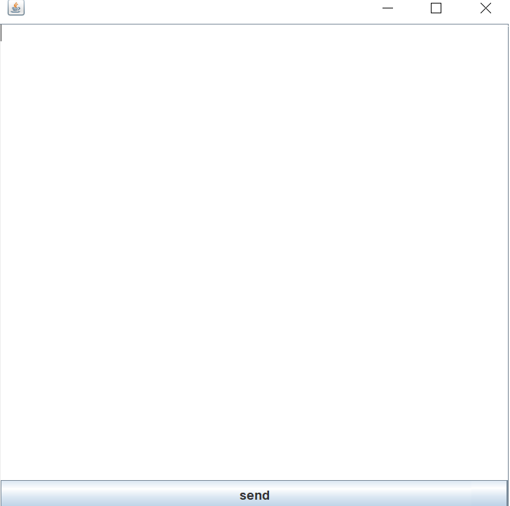

# litterae
encryption message echange

## requirements
jdk 8 minimum

## getting started
- indicate client ip by editing application.properties file `app.clientIp`
- indicate secret phrase that help to encode/decode message `app.secret`

## demo


```
Server started  at:  ServerSocket[addr=localhost/127.0.0.1,localport=6666]
Waiting for a  connection...
connected to server with success
Received a  connection from  Socket[addr=/127.0.0.1,port=63773,localport=6666]
Waiting for a  connection...
message sent with success vYdbVwzM+MHHOSzkNqbosA==
Received from  client: hello
```
